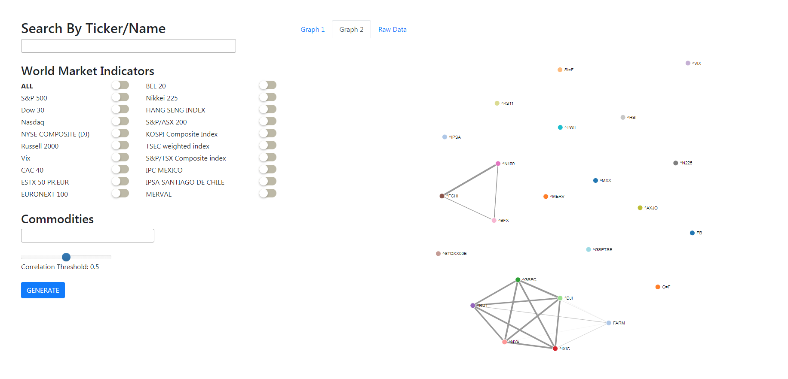

# Stock-Correlation
Pulls historical stock market data from yahoo finance, generates a correlation matrix between the daily change in price for selected stocks, and generates a d3 visualization showing links between correlated stocks

Notes:

Currently using a workaround for yahoo finance API restrictions, will most likely be deprecated soon
If tab is switched before circle graph is done converging D3 will throw an error. Reloading the page fixes this

